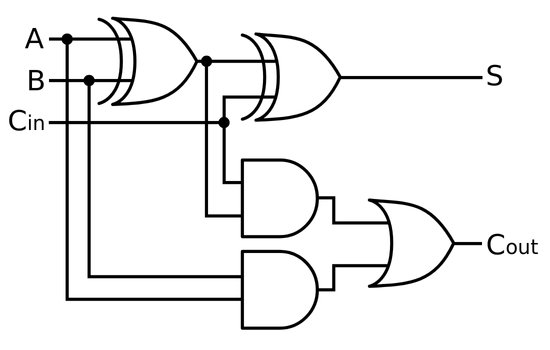

# Verilog

## Tutorial

### Rules to follow

- Use blocking assignments to model combinational logic within an always block.
    - or just implement combinational without an always block, using assign statements.

- Use non-blocking assignments to implement sequential logic.

- Do not mix blocking and non-blocking assignments in the same always block.

- Do not make assignments to the same variable from more than one always block

### Testbench

#### 1. Time Scale

Specifies the simulation granularity

Syntax

``` verilog 
`timescale <time_unit>/<time_precision>
```

Example

``` verilog
`timescale 1s/1ps
```

#### 2. Test Module Definition

- A testbench is a module too!
- No inputs or outputs

``` verilog
module treg4bit_test();
```

#### 3. Module Declarations

- Define input and output signals that will link to our UUT (Unit Under Test)

``` verilog
 // inputs
 reg CLK50;
 reg RESET;
 reg [3:0] IN;
 // outputs
 wire [3:0] OUT;
```

#### 4. UUT Instantiation

- Same as instantiating a submodule

``` verilog
// instance of treg4bit
 treg4bit UUT (
 .CLK(CLK50),
 .RESET(RESET),
 .IN(IN),
 .OUT(OUT)
 );
```

``` plaintext
Verilog Testbench
                .----------.
  UUT           | Verilog  |      UUT
Stimulus    =>  |   UUT    | => Monitor
                `----------`
```

#### 5. Stimulus Generation: Clock

- Generate a 50MHz clock

``` verilog
always
    begin
        CLK50 = 1'b0;
        CLK50 = #10000 1'b1;
        #10000;
    end
```

>
> `#10000` means a delay i.e. wait for 10000 time units before changing
> the value of CLK50 The total time period is 20000 time units
>

#### 6. Stimulus Generation: Initial Block

- Use initial block to write sequential test cases for the circuit

``` verilog
initial
begin
// reset circuit
// ...
// test cases
// ...
end
```

#### 7. Stimulus Generation: Reset

- At beginning of initial block, give initial values to the circuit

``` verilog
// reset circuit
RESET = 1'b1;
IN = 4'b0;

#20000;
// test whether reset is correct
// ...

// enable and start running
RESET = 1'b0;
```

#### 8. Stimulus Generation: Set Inputs

- Set inputs to values for the test case

``` verilog
// enable toggling for only some of the flip-flops
IN = 4'b0011;

#20000; // wait a cycle to observe result
```

#### 9. Monitor

- Compare actual output with expected output
- Display information

``` verilog
if(OUT == 4'b0) begin
 $display("MSIM> Reset is correct, OUT (value in register) now %4b", OUT);
end
else begin
 $display("MSIM> ERROR: Reset is incorrect. OUT (value in register) should be 0000, but is %4b", OUT);
end
```

- Can also use waveforms to see inputs and outputs change over time

#### 10. Pause/Terminate simulation

- Pause simulation (can resume later)

``` verilog
$stop;
```

- Terminate simulation

``` verilog
$finish;
```

## Examples

- [D Flip-Flop](https://www.edaplayground.com/x/9)
- [Registers](https://www.edaplayground.com/x/aZHG)
- [Counter](https://www.edaplayground.com/x/RysB)
- [Count to](https://www.edaplayground.com/x/VhGn)
- [Count down from](https://www.edaplayground.com/x/tJRE)
- [Ripple Carry Counter](https://www.edaplayground.com/x/B8ix)
- [Full Adder](https://www.edaplayground.com/x/Ryvg)
- [Ripple Carry Full Adder](https://www.edaplayground.com/x/MHfx)



- [Shift Register](https://www.edaplayground.com/x/Ged5)
- [RAM](https://www.edaplayground.com/x/QpPJ)
- [Decoder](https://www.edaplayground.com/x/AahX)

<br>

- [Display](https://www.edaplayground.com/x/A7Fc)
- [Define](https://www.edaplayground.com/x/n8Vh)
- [Blocking Assignment vs. Non-blocking Assignment](https://www.edaplayground.com/x/Le4E)
- [Always, @, Event, Wait](https://www.edaplayground.com/x/Chbk)
- [If-else and Case](https://www.edaplayground.com/x/MTDp)
- [Parameter](https://www.edaplayground.com/x/Pfk6)
- [Generate Block](https://www.edaplayground.com/x/Ged5)


## Resources

- [Tutorial FPGA Verilog](https://www.csl.cornell.edu/courses/ece2300/pdf/Tutorial-FPGA-Verilog-SP24.pdf) (Cornell)
- [EDA Playground Verilog Tutorials](https://www.youtube.com/playlist?list=PLScWdLzHpkAfbPhzz1NKHDv2clv1SgsMo)

